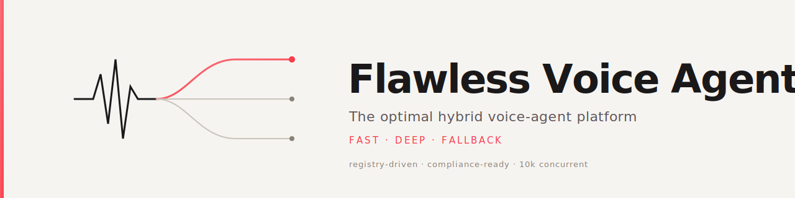
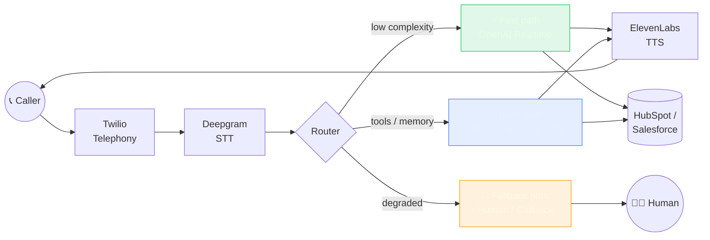
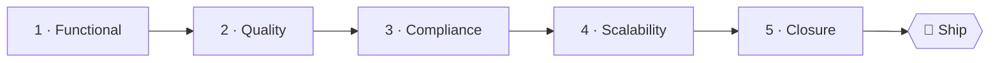

<!-- ════════════════════════════════════════════════════════════════════════ -->
<!--  FLAWLESS VOICE AGENT · README                                            -->
<!--  The optimal hybrid voice-agent platform — dual-path, registry-driven.    -->
<!-- ════════════════════════════════════════════════════════════════════════ -->

<div align="center">
<!-- ─── Banner (dynamic, gradient header) ──────────────────────────────── -->
<a href="https://github.com/flawlessstudio/flawless-voice-agent">
  
</a>

<h1>
  <br/>
  🎙️ Flawless Voice Agent
</h1>

<h3><em>The optimal hybrid voice-agent platform.</em></h3>

<p>
  <strong>Dual-path architecture</strong> (fast · deep · fallback) &nbsp;•&nbsp;
  <strong>Registry-driven</strong> &nbsp;•&nbsp;
  <strong>Compliance-ready</strong> &nbsp;•&nbsp;
  <strong>Scalable to 10k concurrent calls</strong>
</p>

<!-- ─── Status & meta badges (static — render reliably on private repos) ───── -->
<p>
  
  
  <a href="./LICENSE"></a>
</p>
<p>
  
  
  
  
  
  
</p>

<p>
  <a href="#-why-flawless">Why</a> ·
  <a href="#-architecture-at-a-glance">Architecture</a> ·
  <a href="#-tech-stack">Stack</a> ·
  <a href="#-quick-start">Quick start</a> ·
  <a href="#-project-structure">Structure</a> ·
  <a href="#-quality-gates">Gates</a> ·
  <a href="#-documentation">Docs</a> ·
  <a href="#-contributing">Contributing</a>
</p>

</div>

---
## 💡 Why Flawless

Most voice agents force a single trade-off: **fast but shallow**, or **smart but slow**.
Flawless refuses that compromise. Every inbound call is routed in real time across three
cooperating paths, so the caller always gets the *lowest possible latency the conversation
can afford* — and never a dead end.

| | Single-path agents | **Flawless Voice Agent** |
|---|:---:|:---:|
| Latency floor | One fixed budget | ⚡ Adaptive per-turn routing |
| Tool / memory depth | Shallow **or** slow | 🧠 Deep path on demand |
| Failure behaviour | Hard drop | 🛟 Graceful fallback to human |
| Vendor lock-in | Hard-coded | 🧩 Registry-driven, swappable |
| Compliance | Bolted on later | ✅ Consent & disclosure by design |
| Scale | Vertical guesswork | 📈 10k concurrent, autoscaled |

---

## 🏗️ Architecture at a glance

Three paths, one brain. A lightweight **router** inspects each turn and dispatches it to the
cheapest path that can answer correctly, promoting to a deeper path only when the conversation
demands it and degrading gracefully when an upstream provider misbehaves.



<details>
<summary><strong>📂 The three paths, explained</strong></summary>

| Path | When it runs | Pipeline | Optimised for |
|---|---|---|---|
| ⚡ **Fast** | Simple, latency-sensitive turns | Twilio → STT → OpenAI Realtime → ElevenLabs → CRM | Sub-second response |
| 🧠 **Deep** | Tools, memory, multi-step reasoning | Twilio → STT → OpenAI Agents + tools + memory → Handoff | Accuracy & capability |
| 🛟 **Fallback** | Provider failure or escalation | Controlled degradation → Human or callback | Never dropping the caller |

> See [`docs/architecture/overview.md`](./docs/architecture/overview.md) for the full design,
> and the [ADRs](./docs/architecture/adrs/) for the decisions behind each path.

</details>

---
## 🧱 Tech stack

Each layer was selected as the best-in-class "winner" for its role, and every choice is
swappable through the [registry](./registry/) — no provider is hard-wired into the runtime.

| Layer | Winner | Role |
|---|---|---|
| 📡 **Telephony** | [Twilio](https://www.twilio.com/) | Carrier-grade inbound/outbound voice & media streams |
| ✍️ **STT** | [Deepgram](https://deepgram.com/) | Low-latency streaming speech-to-text |
| 🧠 **LLM** | [OpenAI](https://openai.com/) Realtime / Agents | Reasoning, tool use, real-time dialogue |
| 🔊 **TTS** | [ElevenLabs](https://elevenlabs.io/) | Natural streaming text-to-speech |
| 🎛️ **Orchestration** | [Vapi](https://vapi.ai/) + [Retell](https://www.retellai.com/) | Call control, turn-taking, barge-in |
| 🔗 **Integration** | [HubSpot](https://www.hubspot.com/) + [Salesforce](https://www.salesforce.com/) | CRM sync & post-call enrichment |
| 📊 **QA / Analytics** | Custom eval layer | Golden calls, regression, scorecards |

<sub>Runtime: **TypeScript** on **Node ≥ 20**, served with **Fastify** + **ws** (WebSocket media), traced with **Langfuse**.</sub>

---

## 🚀 Quick start

> **Prerequisites:** Node ≥ 20, npm, and (optionally) Docker. Copy [`.env.example`](./.env.example) to `.env` and fill in your provider keys.

```bash
# 1 · Clone & install
git clone https://github.com/flawlessstudio/flawless-voice-agent.git
cd flawless-voice-agent
npm install

# 2 · Configure your environment
cp .env.example .env        # then edit .env with your keys

# 3 · Run
npm run dev                 # hot-reload dev server (tsx watch)
# — or —
npm run build && npm start  # production build + start
```

<details>
<summary><strong>🐳 Prefer Docker?</strong></summary>

```bash
make docker-up     # start all local services via docker-compose
make docker-down   # stop them again
```

</details>

### 🛠️ Common tasks

All day-to-day commands are wrapped in the [`Makefile`](./Makefile) — run `make help` to list them.

| Command | What it does |
|---|---|
| `make dev` | Start the dev server with hot reload |
| `make build` | Compile TypeScript to `dist/` |
| `make test` | Run the full test suite (Jest) |
| `make lint` / `make format` | Lint with ESLint / format with Prettier |
| `make typecheck` | Strict TypeScript type checking |
| `make eval-smoke` | Fast eval suite (&lt; 60s) against golden calls |
| `make eval-regression` | Full regression eval suite |
| `make compliance` | Run consent / disclosure / privacy checks |
| `make audit` | npm security audit (high severity) |

---
## 🗂️ Project structure

```
flawless-voice-agent/
├─ src/                  # Runtime — the heart of the platform
│  ├─ telephony/         #   Twilio media streams & call control
│  ├─ stt/               #   Deepgram streaming speech-to-text
│  ├─ llm/               #   OpenAI Realtime & Agents adapters
│  ├─ tts/               #   ElevenLabs streaming text-to-speech
│  ├─ orchestration/     #   Vapi + Retell turn-taking & barge-in
│  ├─ agents/            #   Multi-agent definitions & handoff logic
│  ├─ integrations/      #   HubSpot + Salesforce CRM connectors
│  ├─ compliance/        #   Consent, disclosure, privacy enforcement
│  ├─ post-call/         #   Enrichment, summaries, CRM write-back
│  ├─ analytics/         #   Metrics, conversion & quality signals
│  ├─ eval/              #   In-process eval harness (LLM-as-judge)
│  ├─ runtime/           #   Session state, routing, lifecycle
│  ├─ api/               #   Fastify HTTP & WebSocket routes
│  ├─ prompts/           #   Prompt loaders & registry
│  ├─ utils/             #   Observability (Langfuse), shared helpers
│  └─ index.ts           #   Entrypoint — boots the server
├─ docs/                 # Architecture, product, operations, legal
├─ registry/             # Core, watchlist, stack recipes, audit log
├─ schemas/              # JSON schemas — candidates, sessions, audits
├─ eval/                 # Metrics, golden calls, regression, scorecards
├─ prompts/              # System, sales, qualification, handoff, fallback
├─ infra/                # Docker, Kubernetes, Terraform, CI
├─ examples/             # Runnable use-case examples
├─ scripts/              # Maintenance & automation scripts
└─ tests/                # Unit, integration, e2e, load
```

---

## ✅ Quality gates

Nothing ships until it clears **five sequential gates**. Each gate is enforced in CI
([`.github/workflows/`](./.github/workflows/)) and must be green before the next begins.



| # | Gate | Verifies |
|:---:|---|---|
| 1 | **Functional** | Call, conversation, CRM sync, handoff |
| 2 | **Quality** | Latency, transcript accuracy, conversion, stability |
| 3 | **Compliance** | Consent, disclosure, privacy — AI Act / TCPA / GDPR |
| 4 | **Scalability** | Load, p95, queues, fallback, autoscaling |
| 5 | **Closure** | Registry consistent, stack frozen, docs final |

---
## 📚 Documentation

The [`docs/`](./docs/) tree is the single source of truth. Start with the overview, then dive in.

| Area | Highlights |
|---|---|
| 🏛️ **Architecture** | [Overview](./docs/architecture/overview.md) · [Fast path](./docs/architecture/fast-path.md) · [Deep path](./docs/architecture/deep-path.md) · [Fallback path](./docs/architecture/fallback-path.md) · [Multi-agent handoff](./docs/architecture/multi-agent-handoff.md) · [Scaling to 10k](./docs/architecture/scaling-10k.md) |
| 🧭 **Decisions (ADRs)** | [Dual-path](./docs/architecture/adrs/ADR-001-dual-path.md) · [Redis session](./docs/architecture/adrs/ADR-002-redis-session.md) · [Registry-driven](./docs/architecture/adrs/ADR-003-registry-driven.md) · [Strict compliance](./docs/architecture/adrs/ADR-004-compliance-strict.md) |
| ⚙️ **Operations** | [Local dev](./docs/operations/local-dev.md) · [Runbook](./docs/operations/runbook.md) · [Observability](./docs/operations/observability.md) · [Human handoff](./docs/operations/handoff-human.md) · [Release checklist](./docs/operations/release-checklist.md) |
| ⚖️ **Legal & compliance** | [Consent model](./docs/legal/consent-model.md) · [Data retention](./docs/legal/data-retention.md) · [GDPR / LOPD](./docs/legal/gdpr-lopd.md) · [Recording consent script](./docs/legal/recording-consent-script.md) |
| 🔌 **API** | [API reference](./docs/api-references.md) |

---

## 🤝 Contributing

Contributions are welcome — and the bar is high. Please read these before opening a PR:

- 📋 [**Contributing guide**](./CONTRIBUTING.md) — workflow, branch naming, commit conventions
- 🤝 [**Code of conduct**](./CODE_OF_CONDUCT.md) — how we treat each other
- 🔐 [**Security policy**](./SECURITY.md) — how to report vulnerabilities responsibly
- 📝 [**Changelog**](./CHANGELOG.md) — what changed, and when

Every change must pass the [quality gates](#-quality-gates) and keep the [registry](./registry/) consistent.

---

## 📄 License

Released under the [**MIT License**](./LICENSE).

<div align="center">
  <br/>
  <sub>Built with precision by <a href="https://github.com/flawlessstudio">Flawless Studio</a> — because the caller deserves flawless.</sub>
</div>
